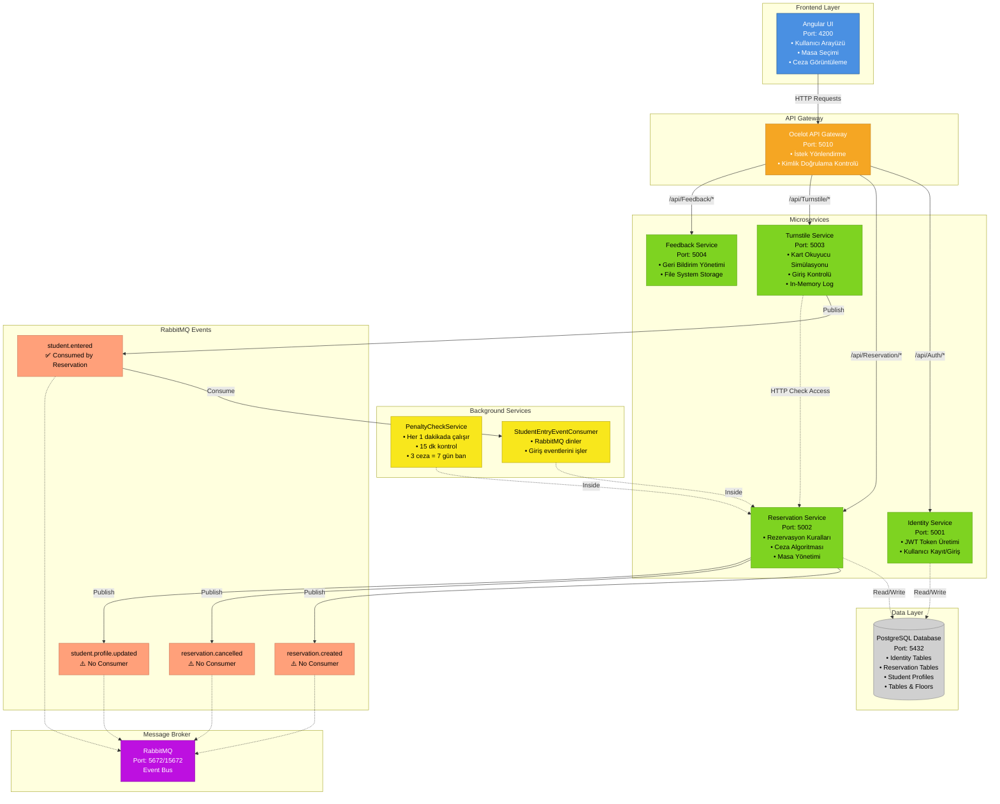
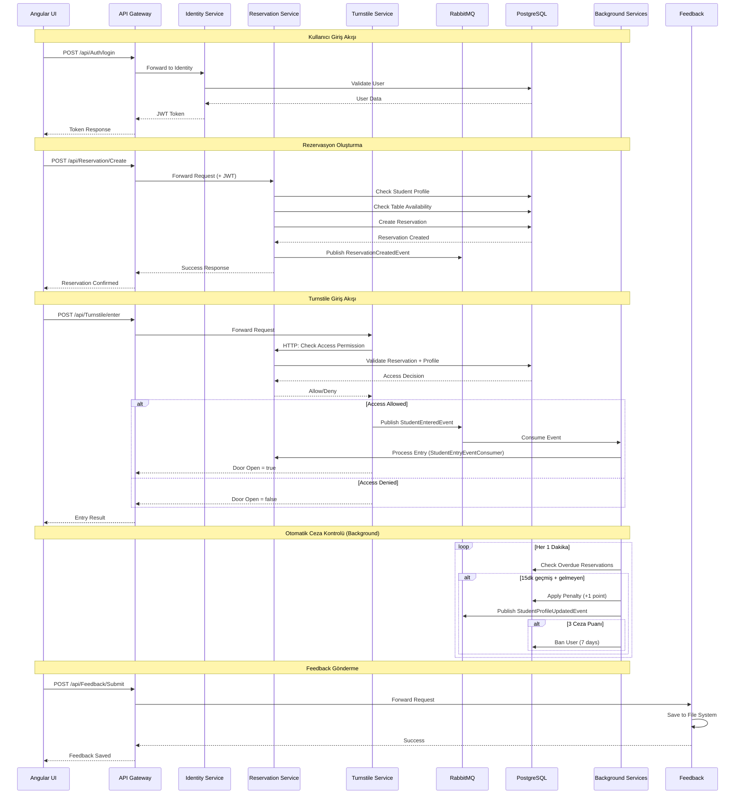
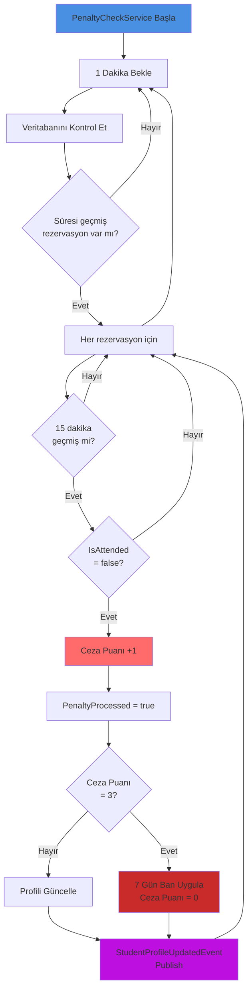

# Kütüphane Rezervasyon Sistemi - Mimari Diyagram

## Sistem Mimarisi



## Detaylı Akış Diyagramı



## Sistem Bileşenleri

### 1. Frontend Layer
- **Angular UI (Port 4200)**
  - Kullanıcı arayüzü
  - Masa seçimi ve rezervasyon oluşturma
  - Ceza puanı görüntüleme
  - API Gateway ile iletişim

### 2. API Gateway
- **Ocelot (Port 5010)**
  - Tüm istekleri merkezi olarak yönlendirir
  - CORS politikalarını yönetir
  - Route yapılandırması:
    - `/api/Auth/*` → Identity Service (5001)
    - `/api/Reservation/*` → Reservation Service (5002)
    - `/api/Turnstile/*` → Turnstile Service (5003)
    - `/api/Feedback/*` → Feedback Service (5004)

### 3. Microservices

#### Identity Service (Port 5001)
- ✅ Kullanıcı kayıt ve giriş
- ✅ JWT token üretimi ve doğrulama
- ✅ PostgreSQL veritabanı kullanır
- ❌ RabbitMQ kullanmaz

#### Reservation Service (Port 5002)
- ✅ Rezervasyon oluşturma ve iptal
- ✅ Masa ve kat yönetimi
- ✅ Öğrenci profili ve ceza yönetimi
- ✅ Rezervasyon kuralları (StudentType bazlı)
- ✅ PostgreSQL veritabanı kullanır
- ✅ RabbitMQ'ya event publish eder
- ✅ RabbitMQ'dan event consume eder
- **Background Services:**
  - `PenaltyCheckService`: Her 1 dakikada otomatik ceza kontrolü
  - `StudentEntryEventConsumer`: Giriş eventlerini dinler

#### Turnstile Service (Port 5003)
- ✅ Kart okuyucu simülasyonu
- ✅ Giriş izni kontrolü (Reservation Service'e HTTP call)
- ✅ RabbitMQ'ya StudentEnteredEvent publish eder
- ❌ Veritabanı kullanmaz (In-memory log)

#### Feedback Service (Port 5004)
- ✅ Geri bildirim yönetimi
- ✅ File system storage (App_Data)
- ❌ Veritabanı kullanmaz
- ❌ RabbitMQ kullanmaz

### 4. Data Layer
- **PostgreSQL (Port 5432)**
  - Tek merkezi veritabanı
  - Identity Service tabloları (AspNetUsers, AspNetRoles)
  - Reservation Service tabloları (Reservations, Tables, Floors, StudentProfiles)

### 5. Message Broker
- **RabbitMQ (Port 5672/15672)**
  - Event-driven architecture için message broker
  - Management UI: http://localhost:15672

## RabbitMQ Event'leri

| Event | Publisher | Consumer | Routing Key | Durum |
|-------|-----------|----------|-------------|-------|
| **StudentEnteredEvent** | Turnstile Service | Reservation Service | `student.entered` | ✅ Çalışıyor |
| **ReservationCreatedEvent** | Reservation Service | - | `reservation.created` | ⚠️ Consumer yok |
| **ReservationCancelledEvent** | Reservation Service | - | `reservation.cancelled` | ⚠️ Consumer yok |
| **StudentProfileUpdatedEvent** | Reservation Service | - | `student.profile.updated` | ⚠️ Consumer yok |

### Event Detayları

#### 1. StudentEnteredEvent ✅
**Publisher:** Turnstile Service  
**Consumer:** Reservation Service (StudentEntryEventConsumer)  
**Ne zaman:** Öğrenci kartını okutup giriş yaptığında  
**İçerik:**
```json
{
  "studentNumber": "202012345",
  "entryTime": "2025-12-21T10:30:00Z",
  "turnstileId": "turnstile-1"
}
```

#### 2. ReservationCreatedEvent ⚠️
**Publisher:** Reservation Service  
**Consumer:** Yok (mimari eksiklik)  
**Ne zaman:** Yeni rezervasyon oluşturulduğunda  
**Potansiyel Kullanım:** Notification service, analytics, audit log

#### 3. ReservationCancelledEvent ⚠️
**Publisher:** Reservation Service  
**Consumer:** Yok (mimari eksiklik)  
**Ne zaman:** Rezervasyon iptal edildiğinde  
**Potansiyel Kullanım:** Notification service, capacity management

#### 4. StudentProfileUpdatedEvent ⚠️
**Publisher:** Reservation Service (PenaltyCheckService)  
**Consumer:** Yok (mimari eksiklik)  
**Ne zaman:** Ceza verildiğinde veya ban uygulandığında  
**Potansiyel Kullanım:** Notification service, email alerts

## Ceza Sistemi Algoritması



## Rezervasyon Kuralları (Student Type)

| Student Type | Max Active Reservations | Max Advance Days | Daily Limit |
|--------------|------------------------|------------------|-------------|
| **Undergraduate** | 2 | 3 gün | 1 |
| **Graduate** | 3 | 7 gün | 2 |
| **PhD** | 5 | 14 gün | 3 |

## Port Listesi

| Servis | Port | Protokol |
|--------|------|----------|
| Angular UI | 4200 | HTTP |
| API Gateway | 5010 | HTTP |
| Identity Service | 5001 | HTTP |
| Reservation Service | 5002 | HTTP |
| Turnstile Service | 5003 | HTTP |
| Feedback Service | 5004 | HTTP |
| PostgreSQL | 5432 | TCP |
| RabbitMQ (AMQP) | 5672 | AMQP |
| RabbitMQ (Management) | 15672 | HTTP |

## Teknoloji Stack

### Backend
- **.NET 8.0** - Tüm mikroservisler
- **ASP.NET Core** - Web API framework
- **Entity Framework Core** - ORM
- **Ocelot** - API Gateway
- **RabbitMQ.Client** - Message broker client
- **PostgreSQL** - İlişkisel veritabanı

### Frontend
- **Angular 18** - SPA framework
- **TypeScript** - Programlama dili
- **RxJS** - Reactive programming

### Infrastructure
- **Docker & Docker Compose** - Container orchestration
- **PostgreSQL 15** - Database
- **RabbitMQ 3.13** - Message broker

## Mimari Kararlar ve Öneriler

### ✅ İyi Yönler
1. Mikroservis mimarisi doğru uygulanmış
2. API Gateway merkezi yönetim sağlıyor
3. Event-driven architecture RabbitMQ ile kurulmuş
4. Background services ile asenkron işlemler
5. JWT tabanlı güvenlik
6. Docker ile kolay deployment

### ⚠️ İyileştirme Önerileri
1. **Consumer Eksikliği**: 3 event publish ediliyor ama consume edilmiyor
   - Notification service eklenebilir
   - Analytics service eklenebilir
   
2. **Turnstile Service Database**: 
   - In-memory yerine Redis kullanılabilir (persistent log için)
   
3. **Feedback Service**: 
   - File system yerine veritabanı kullanılabilir
   
4. **Health Checks**: 
   - Tüm servislere health check endpoint'leri eklenebilir
   
5. **Monitoring**: 
   - Prometheus + Grafana eklenebilir
   - Serilog ile merkezi log toplama
   
6. **API Gateway**: 
   - Rate limiting eklenebilir
   - Request/Response caching

## Güvenlik

- ✅ JWT token tabanlı authentication
- ✅ API Gateway üzerinden merkezi CORS yönetimi
- ⚠️ HTTPS kullanımı (production için gerekli)
- ⚠️ API rate limiting (DDoS koruması)
- ⚠️ Input validation ve sanitization

## Ölçeklenebilirlik

Mevcut mimari horizontal scaling için uygun:
- Mikroservisler bağımsız scale edilebilir
- RabbitMQ ile asenkron iletişim
- Stateless servisler (Turnstile hariç)

**Öneriler:**
- Load balancer eklenebilir
- Redis cache layer eklenebilir
- Database read replicas kullanılabilir

---

**Son Güncelleme:** 21 Aralık 2025  
**Versiyon:** 1.0  
**Proje:** TÜBİTAK 2209-A SAÜ Kütüphane Rezervasyon Sistemi
